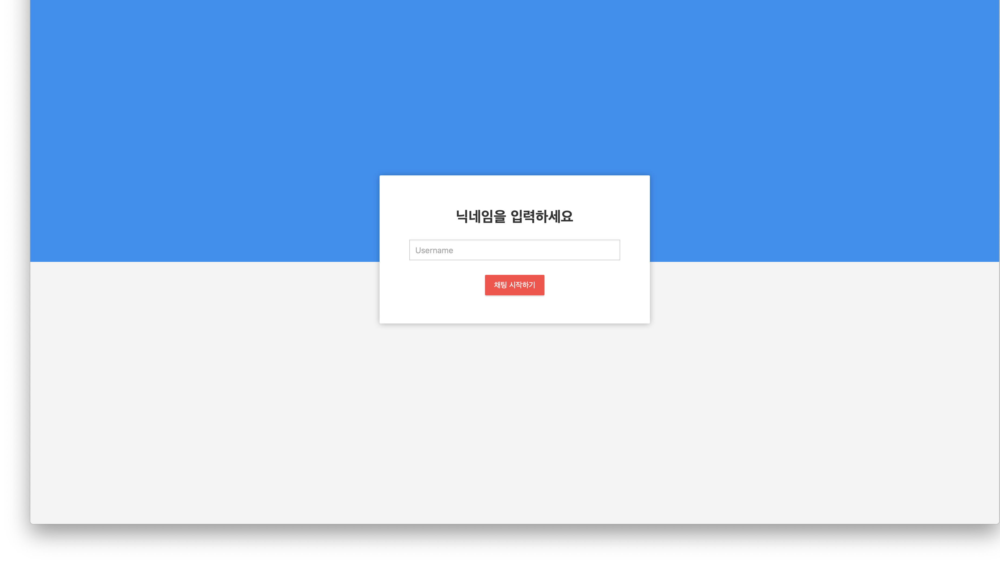

# Spring Boot MVC WebSocket Chatting Server

#### Testing Site : www.springchat.kro.kr

---------------------------------------------------------------
Made by using Spring boot MVC :herb:

If you wanna build, Run terminal and Run command "./gradlew build"
Then, it is just builded and you just run jar file.

There is still bug. :fire:

Fixed bugs will be commit to "develop" branches.

---------------------------------------------------------------
## ScreenShots

Screenshot is not working
